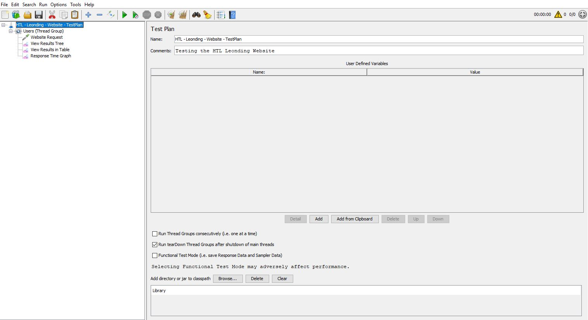

# JMeter

## Generelle Daten
|===
|Von|Apache Software Foundation
|Wozu|Load/Stresstest
|Feature|Viele Request-Arten (Bild unten)
|===
## Links
https://jmeter.apache.org/[JMeter]

## Download / Installation
http://jmeter.apache.org/download_jmeter.cgi[Download-Link]
Grundsätzlich ist die heruntergeladene .ZIP Datei nur zu entpacken und die unter apache-jmeter-5.2.1\bin befindliche "ApacheJMeter.jar" auszuführen.

Nun wird die GUI gestartet und man kann mit dem Testen loslegen.

## GUI

## JMeter is not a browser
(Interessanter Auszug aus der Website)

JMeter is not a browser, it works at protocol level. As far as web-services and remote services are concerned, JMeter looks like a browser (or rather, multiple browsers); however JMeter does not perform all the actions supported by browsers. In particular, JMeter does not execute the Javascript found in HTML pages. Nor does it render the HTML pages as a browser does (it's possible to view the response as HTML etc., but the timings are not included in any samples, and only one sample in one thread is ever displayed at a time). 

## JMeter vs. Gatling
image::https://github.com/1920-5bhif-syp/referate-syp-5bhif/tree/master/Auinger_Antensteiner_Load-%2CStresstest/JMeter/images/JMetervGatling.png[alt="Gatling vs. JMeter"]

Wie man sehen kann bietet JMeter mehr Funktionalität, jedoch fehlt die Möglichkeit Skripte/Programme zu erstellen.

## Struktur
Eine gute Übersicht bietet: https://riptutorial.com/de/jmeter/example/24830/uberblick-uber-apache-jmeter-komponenten-auf-hohem-niveau[Apache-JMeter-Komponenten]

### Übersicht der Komponenten in der UI
image::https://github.com/1920-5bhif-syp/referate-syp-5bhif/tree/master/Auinger_Antensteiner_Load-%2CStresstest/JMeter/images/level1.png[alt="Level 1"]

image::https://github.com/1920-5bhif-syp/referate-syp-5bhif/tree/master/Auinger_Antensteiner_Load-%2CStresstest/JMeter/images/level2.png[alt="Level 2"]

### Verschachtelung der Komponenten
image::https://github.com/1920-5bhif-syp/referate-syp-5bhif/tree/master/Auinger_Antensteiner_Load-%2CStresstest/JMeter/images/drawio.png[alt="Draw IO"]

## Was ist JMX?
Die JMX Dateien sind sozusagen JMeters eigenes XML-Format, in denen die Konfigurationen die man in der UI zusammenstellt abgespeichtert werden.

Das "PARENT"-Element ist immer ein "jmeterTestPlan".

Auszug aus einem HTTP-Request-Loadtest:
....
<jmeterTestPlan version="1.2" properties="5.0" jmeter="5.2.1">
  <hashTree>
    <TestPlan guiclass="TestPlanGui" testclass="TestPlan" testname="HTL - Leonding - Website - TestPlan" enabled="true">
      <stringProp name="TestPlan.comments">Testing the HTL Leonding Website</stringProp>
      <boolProp name="TestPlan.functional_mode">false</boolProp>
      <boolProp name="TestPlan.tearDown_on_shutdown">true</boolProp>
      <boolProp name="TestPlan.serialize_threadgroups">false</boolProp>
      <elementProp name="TestPlan.user_defined_variables" elementType="Arguments" guiclass="ArgumentsPanel" testclass="Arguments" testname="User Defined Variables" enabled="true">
        <collectionProp name="Arguments.arguments"/>
      </elementProp>
      <stringProp name="TestPlan.user_define_classpath"></stringProp>
    </TestPlan>
    <hashTree>
      <ThreadGroup guiclass="ThreadGroupGui" testclass="ThreadGroup" testname="Users (Thread Group)" enabled="true">
      ....
....

## Non-UI Mode
image::https://github.com/1920-5bhif-syp/referate-syp-5bhif/tree/master/Auinger_Antensteiner_Load-%2CStresstest/JMeter/images/JMeter_cmd.JPG[alt="Command Line"]

