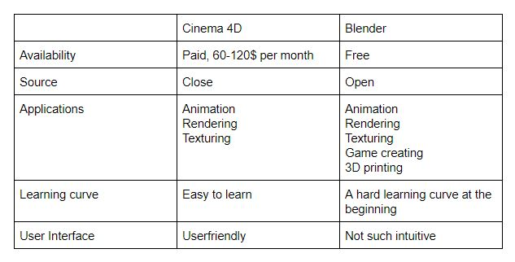

= Blender & Flax

== 3D-Grafik-Software

3D-Grafik-Softwares sind Computerprogramme, womit man dreidimensionale Szenen erstellen und/oder rendern lassen kann.

Wenn nur die Modellierung und Texturierung unterstützt wird, dann redet man von einem 3D-Modellierungswerkzeug.

=== Blender

Blender ist eine Open Source 3D-Grafik-Software. Sie bietet eine Vielfalt von Funktionen, wie das Modellieren, Animieren und noch vieles mehr, an.
Unteranderem unterstützt sie auch Motion Tracking und kann zum Video Editieren verwendet werden.

== Wassersimulation

image::images/water.gif[static,400]

https://imgur.com/GdOzPFb

Bei der Modellierung verwendet man Objekte, welche sogenannte Mesh, Curve, Surface usw sein können. Man arbeitet vor allem mit den Ecken (Vertice), Kanten (Edge) oder Flächen (Face) des Objekts.

Beim Animieren arbeitet man mit dem Skelett der Figur/des Objekts. Falls man eine Bewegung ausführt, wird zu dieser ein Keyframe gespeichert. Mithilfe des Dopesheets kann man die aufgenommenen Keyframes bearbeiten.

Zusätzlich hat man die Möglichkeit eigene Scripts in Python zu schreiben, um Blender eigenständig zu erweitern. Einige Addons bzw. Extensions sind natürlich auch frei verfügbar.

https://de.wikipedia.org/wiki/Blender_(Software))

https://www.blender.org/about/

==== Low-Polygonfigur Tutorial 

https://www.youtube.com/watch?v=0Mui3qDQ5Ow

=== Verwendung von 3D-Grafik-Software

In der Filmindustrie werden solche Programme verwendet. Visual Effects, Bildsynthesen (CGI) und diverse Cartoonfilme benutzen solche Software.

Auch in der Videospielindustrie werden sie gebraucht. Jede Figur, jede Landschaft, auch jedes Objekt dieser virtuellen Welt wird mit einer 3D-Grafik-Software oder Modellierungssoftware erstellt.

In diesen Gebieten gibt es jedoch ein Problem.
Dort existiert bereits seit längerer Zeit einen Standard.
Maya, ZBrush oder andere Software werden bei größeren Projekten verwendet.

=== Cinema 4D vs Blender

https://www.sculpteo.com/blog/2019/08/28/battle-of-software-cinema-4d-vs-blender/

== Mixamo

Mixamo ist eine Webapplikation, welche Animationen und auch vorgefertige Modelle zur Verfügung stellt. Zudem hat man die Möglichkeit eigene Modelle hochzuladen, damit Mixamo für den Benutzer automatisch zu dieser Figur ein Skelett hinzufügt. Dieser Vorgang nennt sich *Rigging* oder nur *Rig*.

https://www.mixamo.com/#/

== Spiel-Engine

Eine Spiel-Engine ist ein spezielles Framework für Computerspiele, das den Spielverlauf steuert und für die visuelle Darstellung des Spielablaufes verantwortlich ist.
Meistens werden diese auch als Entwicklungsumgebung genutzt und bringen dafür auch die nötigen Werkzeuge mit.

== Flax

Die Flax Engine ist eine Spiel-Engine, die darauf Wert legt, dass der Benutzer bzw. die Community eine einfache Handhabung mit dieser Engine haben. Das Ziel von Flax ist es, den Benutzer eine simple Benutzung mit fantastischen Ergebnissen unabhängig vom Preis und der Teamgröße anzubieten.

Flax beschreibt sich selbst als "Something between Unity and UE4".

Unter anderem hat man die Möglichkeit eigene Scripts in C# für Flax zu schreiben, damit bestimmte Funktionalitäten zum Spiel hinzugefügen werden.

https://flaxengine.com/
https://flaxengine.com/features/other/

== Fazit
Blender besitzt verschiedene Funktionalitäten für grafische Darstellung und Bearbeitung .
Durch den Standard in der Spiele- und Filmindustrie schweift die Verwendung von Blender leider ab.
Trotz diesem Nachteil ist Blender für die Einzelperson die beste Option. Da die meisten Modelliertools kostenpflichtig sind und vor allem für größere Projekte
verwendet werden, bietet Blender eine optimale Alternative.
Die Flax Engine ist eine eher unbekannte und neue Spiel-Engine, welche von den anderen existierenden Engine eher rausstechen will. Die Frage, ob Flax nun die beste Spiel-Engine ist, bleibt finde ich eher offen. 

