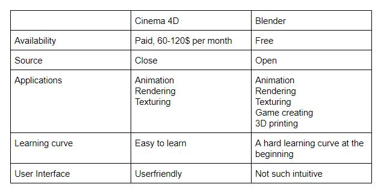

= Blender & Flax

== 3D-Grafik-Software

=== Blender

* Modellieren
* Animieren
* Texturieren
* Simulieren
* Rendern

=== Wassersimulation

image::../images/water.gif[static,750]

https://imgur.com/GdOzPFb

=== Blender: modellieren

* Verwendung von Objekten
** Mesh, Curve, Surface etc.
* Arbeiten mit Vertice, Edge oder Face des Objekts

=== Blender: animieren

* Arbeiten mit Skelett der Figur/des Objekts
* Keyframe für Bewegung 
** Mithilfe des Dopesheets editieren

=== Blender
* Python Scripts (Extension)

=== Low-Polygonfigur Tutorial 

https://www.youtube.com/watch?v=0Mui3qDQ5Ow

+ Beispiel

== Verwendung von 3D-Grafik-Software

* Filmindustrie
** Visual Effects 
** CGI 
** Cartoonfilme

* Spieleindustrie
** Figuren
** Landschaften

== Vergleich

https://www.sculpteo.com/blog/2019/08/28/battle-of-software-cinema-4d-vs-blender/

== Mixamo

* Webapplikation
* Stellt Animationen und Modelle zur Verfügung
* Automatischer *Rig*

=== Beispiel

https://www.mixamo.com/#/

== Spiel-Engine

== Flax

* Open Source
* Einfache Handhabung
* "Something between Unity and UE4"
* C# Scripts

https://flaxengine.com/
https://flaxengine.com/features/other/

=== Beispiel

== Fazit