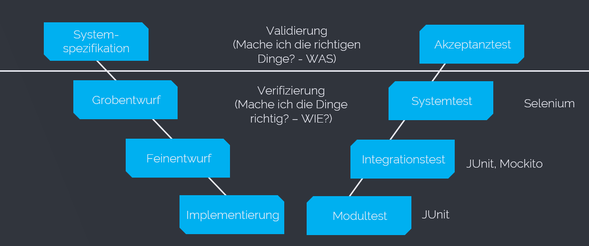
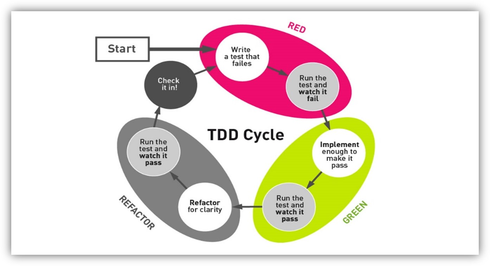

# Referat über JUnit von Stefan Leithenmayr
## Table of Contents
1. [Allgemeines über Testen](#allgemeines-über-testen)
     1.1 [Gründe](#gründe)
     1.2 [V-Modell](#v-modell)
     1.3 [White-Box vs. Black-Box-Tests](#white-box-vs.-black-box-tests)
     1.4 [Test-Driven-Development](#test-driven-development)
     1.5 [Testfall Beispiel](#testfall-beispiel)
2. [JUnit](#junit)
     2.1 [Allgemein](#allgemein)
     2.2 [Lifecycle](#lifecycle)
     2.3 [JUnit 5](#junit-5)

## Allgemeines über Testen
Die offizielle Definition für einen Softwaretest lautet: "Ein Software Test prüft und bewertet Software auf Erfüllung der für ihren Einsatz definierten Anforderungen und misst ihre Qualität. Die Erkenntnisse werden zur Fehlerbehebung genutzt."
Kurz zusammengefasst ein Software Test überprüft ob die Software das tut was sie soll.

### Gründe
* Kostenreduzierung: Falls in der Software ein Fehler vorhanden ist, funktioniert diese nicht wie sie soll. Anschließend muss nachgearbeitet werden bzw. auch Strafen gezahlt werden.
* Sicherheit: Der Sicherheitsaspekt spielt bei Softwaretests in gewissen Anwendungsgebieten eine große Rolle. Befindet sich beispielweise in einer Software für eine Flugzeugssteuerung ein Fehler kann dies schwerwiegende Folgeschäden haben. (z.B. Flugzeugabstürze)
* Qualität: Qualität ist immer das was sich der Kunde vorstellt. Umso besser die Software gegen die Anforderungen getestet wurde, desto zufriedener ist der Kunde. Dadurch wird unsere Software oder auch Unternehmen weiterempfohlen und es wirft einen guten Blick auf das Unternehmen, wenn die Qualität stimmt.

### V-Modell

### White-Box vs. Black-Box-Tests

* White-Box-Test: Bei einem White-Box-Test ist die interne Codestruktur bekannt. Die Person, die die Testfälle entwirft hat den Code meist selbst geschrieben und ist deshalb sehr gut mit diesem vertraut. 

* Black-Box-Test: Bei einem Black-Box-Test ist die interne Codestruktur dem Tester nicht bekannt. Es werden die Fälle, die vorher in der Spezifikation festgelegt wurden. Beispielsweise soll bei einem Algorithmus die zwei Zahlen addiert bei den Eingangsparametern 2 und 3, das Ergebnis 5 herauskommen. Dies weiß der Tester aber nicht, weil man einen Blick auf den Code geworfen hat, sondern weil dies vorher in der Spezifikation definiert wurde.

### Test-Driven-Development

Beim Testen-Driven-Development verfolgt man nun den Ansatz, den geschriebenen Code immer sofort zu testen. Dies ist sehr aufwendig führt aber zu einem fehlerfreieren Code. Zu Beginn eines Implementierungsprozesses wird ein Test geschrieben und ausgeführt. Dieser schlägt zu Beginn fehl, da es noch keine Implementierung gibt. Anschließend implementiert man die entsprechende Methode oder Logik soweit, dass der Test erfolgreich ist. Anschließend wird der Code noch refactored (verbessert) und der Test nochmals ausgeführt. Anschließend begint der Zyklus von vorne und es wird wieder ein Test geschrieben. 

Quelle: http://bellintegrator.com/TestDrivenDevelopment

### Testfall Beispiel

Im nachfolgenden Beispiel ist ein Testfall erklärt anhand des Logins bei Gmail. Dabei wurden die essenziellen Bausteine für eine Testfallbeschreibung verwendet.

* Titel: Login Seite – Authentifizierung mit gmail.com
* Beschreibung des Testfalls: Einloggen mit Gmail
* Vorrausetzungen: Gmail Account wird benötigt
* Annahmen: Ein unterstützter Browser wird verwendet
* Testschritte:
    * gmail.com aufrufen
    * E-Mail eintragen
    * Next Button klicken
    * Passwort eingeben
    * Einloggen Button klicken
* Erwartetes Ergebnis: Emails werden angezeigt
https://blog.testlodge.com/how-to-write-test-cases-for-software-with-sample/

