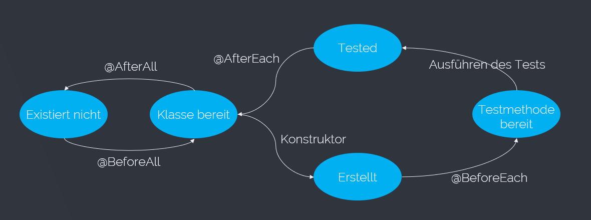

# Referat über JUnit von Stefan Leithenmayr
## Table of Contents
1. [Allgemeines über Testen](#allgemeines-über-testen)
    <br>1.1 [Gründe](#gründe)
    <br>1.2 [V-Modell](#v-modell)
    <br>1.3 [White-Box vs. Black-Box-Tests](#white-box-vs-black-box-tests)
    <br>1.4 [Test-Driven-Development](#test-driven-development)
    <br>1.5 [Testfall Beispiel](#testfall-beispiel)
2. [JUnit](#junit)
    <br>2.1 [Allgemein](#allgemein)
    <br>2.2 [Lifecycle](#lifecycle)
    <br>2.3 [JUnit 5](#junit-5)

## Allgemeines über Testen
Die offizielle Definition für einen Softwaretest lautet: "Ein Software Test prüft und bewertet Software auf Erfüllung der für ihren Einsatz definierten Anforderungen und misst ihre Qualität. Die Erkenntnisse werden zur Fehlerbehebung genutzt."
Kurz zusammengefasst ein Software Test überprüft ob die Software das tut was sie soll.

### Gründe
* Kostenreduzierung: Falls in der Software ein Fehler vorhanden ist, funktioniert diese nicht wie sie soll. Anschließend muss nachgearbeitet werden bzw. auch Strafen gezahlt werden.
* Sicherheit: Der Sicherheitsaspekt spielt bei Softwaretests in gewissen Anwendungsgebieten eine große Rolle. Befindet sich beispielweise in einer Software für eine Flugzeugssteuerung ein Fehler kann dies schwerwiegende Folgeschäden haben. (z.B. Flugzeugabstürze)
* Qualität: Qualität ist immer das was sich der Kunde vorstellt. Umso besser die Software gegen die Anforderungen getestet wurde, desto zufriedener ist der Kunde. Dadurch wird unsere Software oder auch Unternehmen weiterempfohlen und es wirft einen guten Blick auf das Unternehmen, wenn die Qualität stimmt.

### V-Modell


### White-Box vs. Black-Box-Tests

* White-Box-Test: Bei einem White-Box-Test ist die interne Codestruktur bekannt. Die Person, die die Testfälle entwirft hat den Code meist selbst geschrieben und ist deshalb sehr gut mit diesem vertraut. 

* Black-Box-Test: Bei einem Black-Box-Test ist die interne Codestruktur dem Tester nicht bekannt. Es werden die Fälle, die vorher in der Spezifikation festgelegt wurden. Beispielsweise soll bei einem Algorithmus die zwei Zahlen addiert bei den Eingangsparametern 2 und 3, das Ergebnis 5 herauskommen. Dies weiß der Tester aber nicht, weil man einen Blick auf den Code geworfen hat, sondern weil dies vorher in der Spezifikation definiert wurde.

### Test-Driven-Development

Beim Testen-Driven-Development verfolgt man nun den Ansatz, den geschriebenen Code immer sofort zu testen. Dies ist sehr aufwendig führt aber zu einem fehlerfreieren Code. Zu Beginn eines Implementierungsprozesses wird ein Test geschrieben und ausgeführt. Dieser schlägt zu Beginn fehl, da es noch keine Implementierung gibt. Anschließend implementiert man die entsprechende Methode oder Logik soweit, dass der Test erfolgreich ist. Anschließend wird der Code noch refactored (verbessert) und der Test nochmals ausgeführt. Anschließend begint der Zyklus von vorne und es wird wieder ein Test geschrieben. 


Quelle: http://bellintegrator.com/TestDrivenDevelopment

### Testfall Beispiel

Im nachfolgenden Beispiel ist ein Testfall erklärt anhand des Logins bei Gmail. Dabei wurden die essenziellen Bausteine für eine Testfallbeschreibung verwendet.

* Titel: Login Seite – Authentifizierung mit gmail.com
* Beschreibung des Testfalls: Einloggen mit Gmail
* Vorrausetzungen: Gmail Account wird benötigt
* Annahmen: Ein unterstützter Browser wird verwendet
* Testschritte:
    * gmail.com aufrufen
    * E-Mail eintragen
    * Next Button klicken
    * Passwort eingeben
    * Einloggen Button klicken
* Erwartetes Ergebnis: Emails werden angezeigt
https://blog.testlodge.com/how-to-write-test-cases-for-software-with-sample/

## JUnit
### Allgemein
JUnit ist eine Bibliothek für Java, um Unit-Tests durchzuführen.
Die aktuelle JUnit Version ist 5. Seit JUnit 5 gibt es eine neue Architektur. Statt einem großen JAR-File gibt es nun 3 Module. Zum einen gibt besteht es aus JUnit Platform, welche das Fundament bildet und welches den Exekuter etc. beinhaltet.
Die eigentlich JUnit 5 Funktionalität befindet sich in JUnit Jupiter. In JUnit Vintage befindet sich noch der Support von JUnit 3 und 4. JUnit ist ein Framework zum einfachen Testen von Modulen und Algorithmen, für Java Programme. Es wird hauptsächlich für Unit Tests eingesetzt. Der Name JUnit Jupiter kommt daher das der Jupiter der 5-te Planet aus unserem Sonnensystem ist.

### Lifecycle
Der Lifecycle einer Testklasse ist durch verschiedene Methoden aufgebaut, die in nachstehendem Diagramm abgebildet sind. Wichtig dabei ist, dass vor jeder Testmethode der Konstruktor aufgerufen wird. Dies ist etwas ungewöhnlich führt aber dazu, dass sich die Tests nicht gegenseitig beeinflussen.



### JUnit 5
Neuerungen in JUnit 5:

* Assertions und Lambda: In JUnit 5 gibt es Assertions die mehrere Assertions zusammen überprüfen. Vorteil dabei ist, dass falls eine Assertion fehlschlägt die restlichen dennoch ausgeführt werden. Ein weiterer Vorteil ist, dass nun auch Lambda Expressions verwendet werden können.

````
assertAll("Do many assertions.", () -> {
            assertNotNull(actual);
            assertEquals(expAge, actual);
        });
````

* @Disabled-Annotation: Diese Annotation führt dazu, dass die Tests nicht ausgeführt werden jedoch angezeigt werden. In Pipilines wie Jenkins führt das dazu, dass der Build nicht fehlschlägt, falls die Testfunktionalität noch nicht implementiert wurde.

* Nested-Klassen: In JUnit 5 gibt es nun Nested-Klassen, welche in eine andere Klasse integriert werden können.

````
@Nested
    class Book{
        @Test
        void booking_checkin() {
        }

        @Test
        void booking_checkout() {
        }
    }
````

Dies führt zu einer schöneren Ausgabe.

* DisplayName-Annotation: Mit dieser Annotation kann nun ein Testfallname vergeben werden. Außerdem können noch auch andere Symbole wie Smileys etc. verwendet werden können.

````
@Test
@DisplayName("booking successfull test")
void booking_checkin() {
}
```` 