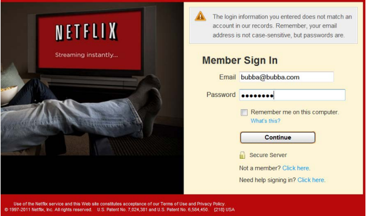
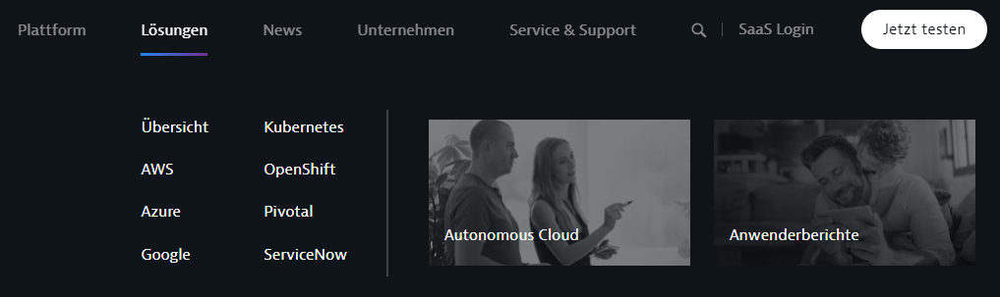
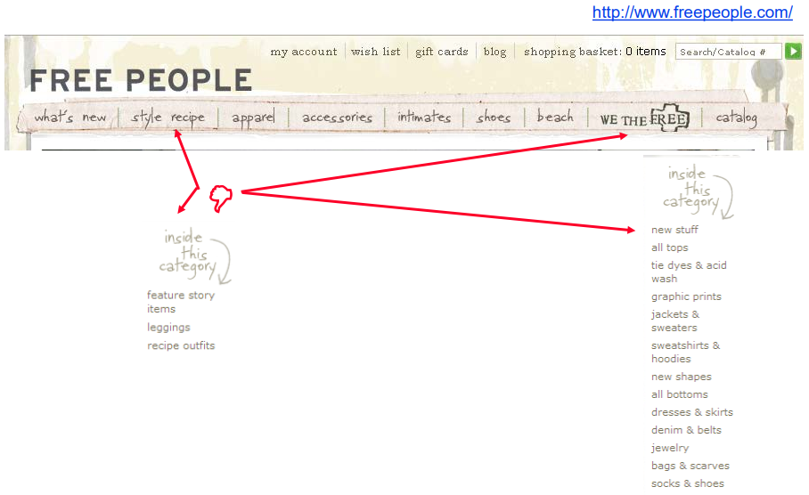
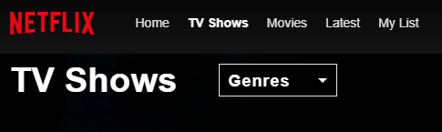
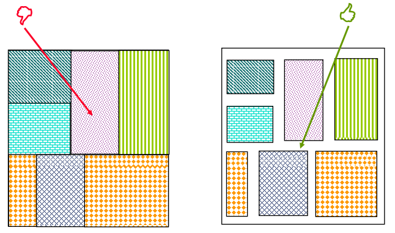
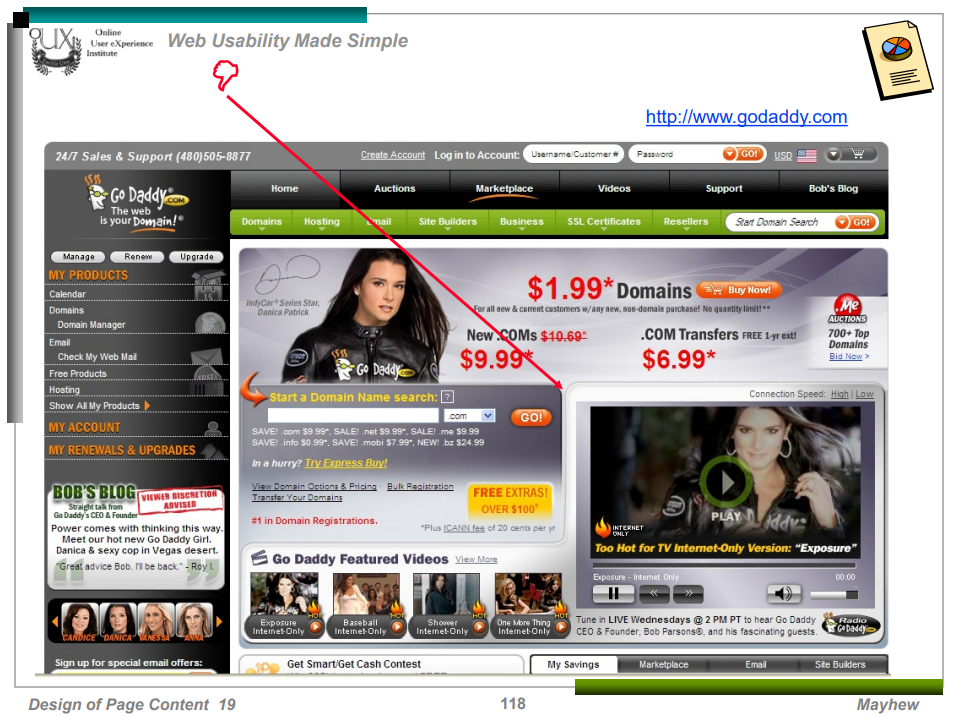
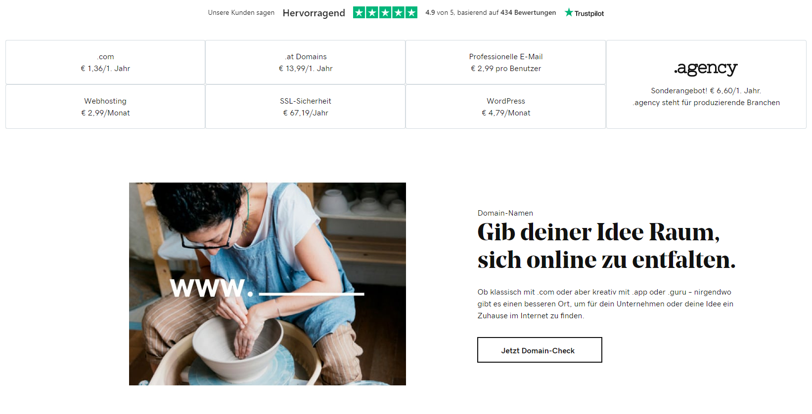
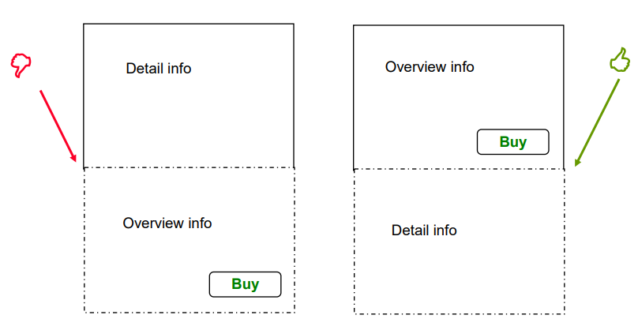
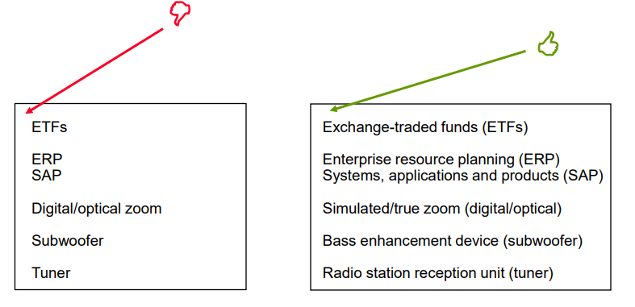
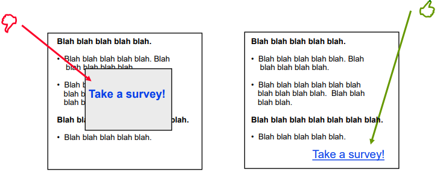

= Usability (Teil 2/2)
:icons: font

== Einleitung
Die Zahlenfolge #1 2 1 2 1 2 1 2 1 2 1 2# wird leichter zu merken sein als 
#3 8 5 1 6 2 0 7 4 9 5 2# +
Grund: hinter der ersten Zahlenfolge steckt ein *Pattern* (Muster)

TIP: Pattern bringen *Konsistenz* (Gleichmäßigkeit) und sind deshalb leichter zu merken und verständlicher fürs Lernen

Relevant zum Thema Usability? -> Ja, denn nur wer versteht, wie das menschliche Gedächtnis funktioniert, kann gute und einprägsame Oberflächen gestalten

== User eXperiene (UX)
Was versteht man unter diesem Begriff? -> 

NOTE: *„Gesamtqualität des Besuchs und der Nutzung einer Website sowie die Summe der Wahrnehmungen eines Besuchs“* +

Unterbewusst bewertet ein Benutzer eine Website auf folgende Punkte:

-	*Nutzen* bzw. *Nützlichkeit* der Informationen
-	*Funktioniert* die Webseite *einwandfrei*?
-	Bedienbarkeit der Website – *„Usability“*
-	*Überzeugungskraft*, mit der Website zu *interagieren*
-	*Emotionale Reaktion* basierend auf dem graphischen *Design* (nicht jeder Person gefällt jedes Design – *subjektiv*)

== Netflix Login Page - alt

Beim Design einer Website sollen die nachkommenden Merkmale vermieden werden:

-	*Farbkombination* (kein Kontrast; keine „harmonischen“ Farben)
-	*Links im Standard Blauton* 
-	*Button nicht aussagekräftig* -> besser: “Log In“
-	*Fehlermeldung ist nichtssagend* (E-Mail oder Password rot markieren)

== Netflix Login Page - derzeit

image::images/netflix_derzeit.png[]

Es lassen sich folgende Merkmale feststellen:

-	*Passender Hintergrund*
-	*ansprechende Farbkombination*
-	deutlich *erkennbare Fehlermeldungen*
-	*aussagekräftiger Button*
-	*schlichtes und schönes Design* 

Derzeit wird auf Labels verzichtet und stattdessen auf sog. „Input-Placeholders“ („Eingabe-Platzhalter“) gesetzt.

== Usability

TIP: Ist Teil der „User Experience“, und zwar bei der *Interaktion mit dem User-Interface*

*	*„Ease-of-Learning/Remembering”* -> für Erst- und Gelegenheitsbesucher
**	„Wie schnell findet sich ein Erst- oder Gelegenheitsbesucher auf der Website zurecht?“
**	„Wie leicht und intuitiv ist es für ihn, sein Ziel des Besuches zu erreichen?“
*	*„Ease-of-Use“* -> für regelmäßige und „erfahrene“ Besucher
**	„Wie leicht und intuitiv ist es für einen erfahrenen Benutzer, sein Ziel des Besuches zu erreichen?“

TIP: „Usability“ ist zu einem hohen Grad *subjektiv*, da der eine Benutzer gerne viel Inhalt lesen möchte, ein anderer hingegen Stichwörter bevorzugt. 

Bsp. [Die einen Lehrer finden Marketing Folien gut, die anderen eher weniger 😉] +
Es gibt jedoch gewisse Richtlinien, an die man sich als Entwickler bzw. Designer halten soll.

Falls möglich, versuchen Sie, das User Interface der Website auf Ihre Zielgruppe anzupassen: (es müssen Gemeinsamkeiten gefunden werden)
-	*Farbe* (rosa passt nicht für einen Harley-Davidson Shop, dafür für eine Website, die Barbie Puppen verkauft)
-	*Schrift* (älteres Publikum, sofern man über das Alter bescheid weiß, hat gerne eine große Schrift mit Step-by-Step Anleitungen und genauer Erklärung)
-	*Intellekt* (auf einer Website für Golfer oder Dressurreiter sollte ein schlichtes Design sowie ein gehobener Wortschatz verwendet werden; bei der Website einer gewissen österreichischen Partei reichen viele bunte Bilder und wenig Text 😉)

TIP: Orientieren Sie sich an „Vorreiter-Websites“ wie z.B.: Apple und Netflix und versuchen Sie, diese genau zu analysieren.

== Design Richtlinien - Navigationsstruktur

TIP: Soll Sinn für die Benutzer ergeben und dessen Ziele unterstützen, d. h. dem Benutzer helfen, was er finden möchte.

Auf der Website der Firma dynatrace ist das gut veranschaulicht. 

TIP: Die *Elemente der Navigation Bar sind eindeutig*. 
Jeder Begriff ist in weitere Unterbegriffe gegliedert und es ist aufgrund der *Farbwahl* und des *Kontrasts* erkennbar, dass „Lösungen“ angeklickt wurde 

== Navigationsstruktur - so nicht!

TIP: Der Kontrast bzw. die Farbwahl sind *nicht ansprechend*. Betrachtet man die Navigation Bar fällt auf, dass die Begriffe *nicht eindeutig* sind und deshalb *Verwirrung* entsteht. 

Wo ist der Unterschied zwischen „what’s new“ und „new stuff“ (bei Überkategorie „We the free“)? +
Wieso gibt es bei „We the free“ eine Unterkategorie „socks & shoes“, wo doch ebenfalls eine Überkategorie namens „shoes“ existiert?...

== Navigationsstruktur

TIP: Navigation Bar darf *nicht zu „tief“* sein -> es soll kein vollständiger „Tree“ aufgebaut werden, da die Navigationsstruktur sonst ihre *Übersichtlichkeit verliert*. 

Wird auf ein Element der Navigation Bar geklickt, darf die *Navigation Bar* nicht verschwinden, sondern *muss bleiben* -> auf dem Netflix Screenshot gut zu sehen (TV-Shows ist ausgewählt, Navigation Bar bleibt)

TIP: Des Weiteren kann es hilfreich sein, dem Benutzer mitzuteilen, wo genau im Pfad er sich gerade befindet und wie er zu diesem Pfad gekommen ist.

== Design des Inhaltes - Trennung durch Whitespaces

TIP: Trennung durch Whitespaces. Vermeiden Sie ein überladenes Seitendesign, da es für den Benutzer überwältigend wirkt. Durch Whitespaces entsteht eine *Gruppierung von Informationen* und dadurch wird die Website übersichtlicher. 

== Design des Inhaltes - so nicht!

Auf der alten Website von „Go-daddy.com“ erkennen Sie, wie es aussieht, wenn man keine Whitespaces macht.

== Design des Inhaltes - so schon!

Go-Daddy hat aus den gemachten Fehlern gelernt und – wie auf diesem Bild zu sehen ist – die Trennung durch Whitespaces verwendet, um ein schlichtes und gut lesbares User Interface zu gewährleisten.

== Design des Inhaltes - wichtige Infos oben!
Wichtige Infos oben. Ziemlich selbsterklärend, weitere Infos in Teil 1 (von Mario Lengauer). 

TIP: Kurze und prägnante Texte, welche formatiert werden sollen -> Whitespaces, bullet points bzw. fette/kursive Schrift.

Aufpassen muss man noch bei 
-	der *Farbwahl* (kein Grün auf Gelb oder dergleichen  Schrift muss sich eindeutig von dem Hintergrund abheben/unterscheiden)
-	*Schriftgröße*
-	Verwendung von *Großschrift* („Capital Letters“) 
-	*Font-Auswahl* (dafür ist fonts.google.com hilfreich  Auswahl an Fonts + Pairing-Möglichkeiten der besten Font-Kombinationen) 

== Design des Inhaltes - Fachjargon vermeiden!

Nur weil man selbst weiß, dass UI für „User Interface“ steht, heißt das noch lange nicht, dass die Besucher der Website ebenfalls über dieses Wissen verfügen. 

TIP: Es ist besser, den Begriff auszuschreiben und danach in Klammern die Abkürzung angeben.

Das gilt selbstverständlich nur, wenn die Besucher *NICHT vom Fach* sind. +
Ein Adam Bien hat nicht „Java Platform, Enterprise Edition“ gesagt, sondern lediglich „JEE“.

== Design des Inhaltes

TIP: Geben Sie den Benutzern die Kontrolle über Sound und Video. 

D.h. keine Slideshows mit vorgegebener Geschwindigkeit ohne Möglichkeit zu pausieren etc. 

TIP: Mit Pop-ups sehr sparsam umgehen, denn diese stören meist den Benutzer und wirken oftmals unprofessionell.

Es gibt jedoch Situationen, in denen Pop-ups einen Sinn machen: wenn der aktuelle Speicherstand verloren gehen würde -> +
Bsp.: Ausfüllen eines Formulars bevor Seite geschlossen wird

== Richtlinien-Checklist

Diese Richtlinien-Checklist ist in 3 Teile gegliedert: der *Navigationsstruktur*, dem *Design der Navigation* und dem *Design des Inhaltes* der Website. 

CAUTION: Diese Checklist (Web-Usability-Made-Simply.xls) ist von 2009, nichtsdestotrotz stellt sie eine gute Grundlage für das Designen eines User Interfaces dar. 

TIP: Es ist nicht notwendig (und sinnvoll), jeder Richtlinie blind zu vertrauen. Sie soll lediglich Bewusstsein schaffen und zum Nachdenken anregen, eventuell Änderungen am Design vorzunehmen. 

== Wie sollen Benutzeroberflächen designed werden?

TIP: Es gibt *kein* „Exhibit A“ („perfektes Beispiel“). 

Wenn jede Website im Internet gleich gestaltet wäre, wozu überhaupt Web Design? +
Deshalb ist es vollkommen in Ordnung, etwas Neues auszuprobieren und frischen Wind in seine Benutzeroberflächen zu bringen – im Optimalfall unter Berücksichtigung der in diesem Referat erwähnten Richtlinien. 

TIP: Es ist jedoch sinnvoll, sich an den vorher genannten „Vorreiter-Websites“ zu orientieren und sich inspirieren zu lassen, um im Trend der Zeit zu bleiben. 

== Quelle

Udemy Kurs „Web Design Made Simple” von Deborah Mayhew
