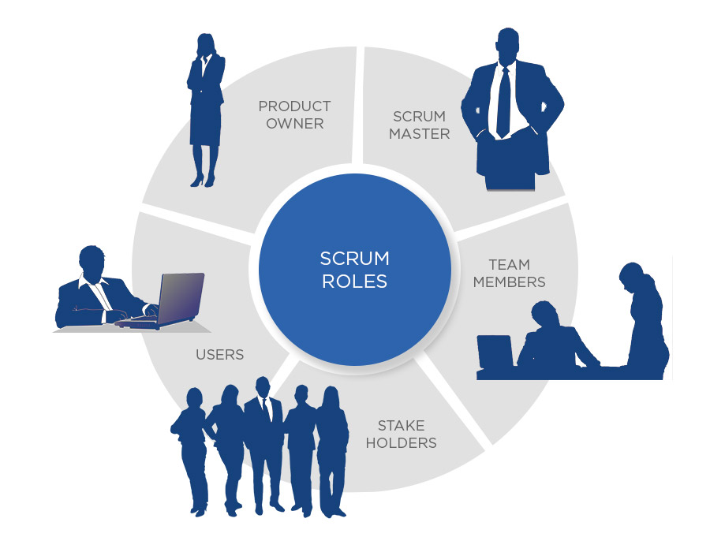

# Scrum - Kanban

# Überblick

Früher waren hauptsächlich zwei Arten von Vorgehensmodellen in der Software Entwicklung verbreitet.

## Wasserfallmodell

Das Wasserfallmodell ist ein lineares, vorallem kein iteratives Vorgehensmodell, das Entwicklungsprozesse in aufeinanderfolgende Projektphasen unterteilt. Aktivitäten müssen in der vorgegebenen Reihenfolge vollständig nacheinander durchgeführt werden. Die Resultate einer Phase fließen in die nächste Phase mit ein. 

### Ablauf

- **Problemanalyse**: Hier überlegt sich der Kunde, was das eigenltiche Problem ist und was er sich von dem Projekt erwartet. Er definiert in einem **Lastenheft** seine Basisanforderungen und das grobe Konzept vom Projekt. Wie das umzusetzen ist, wird im Lastenheft noch nicht beschrieben. Lastenheft = Kundenspezifikation
- **Anforderungsdefinition**: Das Ergebniss der Anforderungsdefinition ist das **Pflichtenheft**, welches die ausformulierten Lösungen sowie die detaillierten Anforderungen auf Basis des Lastenhefts des Auftraggebers enthält . Pflichtheft = Fachspezifikation
- **Entwurf**: Hier wird die **System Architektur** festgelegt. Dazu gehören Klassendiagramme, UML Diagramme, welche Frameworks/Bibliotheken verwendet werden und die Definition von Schnittstellen.
- **Implementierung**: Software wird entwickelt.
- **Test**: Software wird gemäß den Anforderungen bzw. auf allgemeine Fehler getestet.
- **Einsatz & Wartung**: Fertige Software wird dem Kunden übermittelt und danach wird sie noch gewartet.

## V-Modell

Ähnlich zum Wasserfallmodell. Zusätzlich werden den Entwicklungsphasen Testphasen gegenübergestellt. So entsteht das namensgebende V.

- **Anforderungsdefinition**: Anforderungen werden definiert.
- **Grobentwurf**: Man beschreibt ganz grob, wie das System die Anforderungen umsetzen soll. Die technische Umsetzung wird noch nicht festgelegt.
- **Feinentwurf**: Systemarchitektur wird festgelegt.
- **Modulimplementierung**: Die einzelnen Komponenten werden implementiert.
- **Modultest**: Einzelne Komponenten z.B. Klassen werden in sich abgeschlossen getestet. (z.B. mit Unit Tests)
- **Integrationstest**: Schnittstellen werden getestet.
- **Systemtest**: Das gesamte System wird getestet.
- **Abnahmetest**: Das System wird zusammen mit dem Benutzer getestet, gemäß den definierten Anforderungen.

## Nachteile dieser beiden Vorgehensmodelle

- Geringer bis kein Spielraum für Anpassungen des Projektablaufs aufgrund veränderter Anforderungen.
- Der Endanwender wird erst nach der Programmierung in den Produktionsprozess eingebunden.
- Fehler werden mitunter erst am Ende des Entwicklungsprozesses erkannt.
- Paralelles Arbeiten von verschiedenen Teams beschränkt.
- Die einzelnen Phasen laufen in der Theorie nacheinander ab, in der Praxis sind jedoch Rückschritte oft unvermeidlich.

# Agiles Projektmanagment

Um diese eben genannten Nachteile zu umgehen, wurde das agile Projektmanagment eingeführt. Grundprinzip aller agiler Ansätze ist das Arbeiten in kurzen Iterationszyklen, bei denen jeweils dem Auftraggeber ein vorläufiges Ergebnis präsentiert wird und dieser entsprechende Änderungsanträge stellen kann. Dadurch entsteht die Spezifikation des Produkts erst im Laufe des Projekts selbst. Als Referenz für Agiles Projektmanagment gibt es ein Agiles Manifest mit vier Kernaussagen:

- **Menschen und Interaktionen** sind wichtiger als *Prozesse und Werkzeuge*
- **Funktionierende Software** ist wichtiger als eine *umfassende Dokumentation*
- **Zusammenarbeit mit dem Kunden** ist wichtiger als die *Vertragsverhandlung*
- **Reagieren auf Veränderung** ist wichtiger als das *Festhalten an einem Plan*

Wichtig zu erwähnen ist, dass die Dinge auf der rechten Seite durchaus einen Wert haben, jedoch schätzt man die Dinge auf der linken Seite als wertvoller ein.

# Scrum

Scrum ist eines der bekanntesten Vorgehensmodell für agiles Projektmanagement. Der Begriff stammt aus dem Rugby, wo das angeordnete Gedränge der Spieler um den Ball gemeint ist, um das Spiel nach kleineren Regelverstößen neuzustarten. Scrum funktioniert, inkrementell und iterativ, das heißt, in kleinen Schritten und in Etappen die sich wiederholen.

Scrum teilt die Projektlaufzeit in Etappen , sogenannte **Sprints**, ein. Die Dauer von so einem Sprint variiert von ungefähr 2 Wochen bis hin zu 30 Tagen. Während dieser Zeit wird dem Produkt neue Funktionalität hinzugefügt bzw. die vorhandene Funktionalität verbessert. Am Ende jedes Sprints sollte ein voll funktionsfähiges Zwischenprodukt, das sogenannte **Product Increment** stehen, das dem Auftraggeber zur Überprüfung vorgelegt wird. Auf der Basis seines Feedbacks wird dann im nächsten Sprint weiter am Produkt gearbeitet.

## Rollen

Bei Scrum sind folgende Rollen beteiligt:

- **Product Owner**: Der Prodcut Owner steht stellvertretend für die Anwender des Produkts. Seine Aufgabe ist es, fachliche Anforderungen an das Produkt zu stellen und diese zu priorisieren. Beim Product Owner handelt es sich immer um eine Einzelperson.
- **Entwicklungsteam**: Das Entwicklungsteam braucht aufgrund der geringen Größe (cirka fünf bis zehn Mitglieder) keinen klassischen Projektleiter. Es entwickelt das Produkt, gemäß den Produktanforderungen die vom Product Owner festgelegt wurden. Alle Fachbereiche, die zur Lösung beitragen, sollten vertreten sein. (Entwickler, Tester usw.)
- **Scrum Master**: Der Scrum Master ist nicht der Projektleiter. Er ist vielmehr dafür verantwortlich, dass Scrum überhaupt funktioniert und verkörpert eine Art Moderatorenrolle. Er ist zuständig dass die Kommunikation innerhalb des Teams und mit dem Product Owner funktioniert, genauso wie die Moderation von Meetings. Er schirmt das Team von Störungen von außen (z.B. von zusätzlichen Aufgaben) ab, ist Ansprechpartner für Außenstehende und beschafft notwendige Ressourcen.
- **Stakeholder**: Auftraggeber - oder generell Interessierete an dem Projekt
- **User**: welche das fertige Produkt verwenden

## Scrum Prozess

Neben den Rollen ist es vor allem der Prozess, der kennzeichnend ist für Scrum.

Der prinzipielle Ablauf von Scrum schaut wie folgt aus:

### Procut Backlog anlegen

Zuallererst wird vom Prodcut Owner eine priorisierte Liste von Anforderungen für das Projekt erstellt, auch genannt als Product Backlog. Eine hohe Priorität erhalten die Elemente und Funktionen die am wichtigsten sind. Der Product Backlog wird ständig weiter enwickelt. Der Product Owner beschreibt in einer User Story die Anforderungen aus der Nutzersicht. Neben User Storys, gibt es auch noch Themes, Epics und Tasks.

- **Epic**: Ein Epic wird als Platzhalter für große Anforderungen verwendet und wird auch als große User Story bezeichnet. Ein Epic ist zu groß für einen Sprint und sollte in mehrere User Stories unterteilt werden.  Die zerlegten User Stories von einem Epic haben ein gemeinsames Ziel und ein bestimmtes Ergebnis.
- **Theme**: Ein Theme bietet eine Möglichkeit, um darauf hinzuweisen, dass eine Reihe verwandter Epics etwas gemeinsam haben, z.B. dass sie sich im selben Funktionsbereich befinden.
- **Task**: Entwickler zerlegen eine Story in einzelne Aufgaben (Tasks).

Eine User Story sollte wie folgt definiert sein: "**Als [Rolle] möchte ich [Funktion] um [Nutzen]**"

Beispiel: Als Webshop Kunde möchte ich einen Login, um meine bisherigen Bestellungen zu sehen, zu kontrollieren und Rechnungen auszudrucken.

Eine gute User Story ist durch folgende Eigenschaften gekennzeichnet:

- **Independent** (unabhängig): User Stories sollen unabhängig voneinander sein.
- **Negotiable** (verhandelbar): User Stories sollen verhandelbar sein.
- **Valuable** (nützlich): User Stories sollen einen Wert für den Kunden haben.
- **Estimable** (schätzbar): User Stories sollen schätzbar sein.
- **Small** (klein): User Stories sollen klein sein um in einem Sprint realisierbar zu sein.
- **Testable** (testbar): User Stories sollen testbar sein.

Damit User Storys akzeptiert werden, müssen sogenannte **Akzeptanzkriterien** erfüllt werden. Akzeptanzkriterien sind Bedingungen, die die Software erfüllen muss, um die Bedürfnisse der Kunden zu befriedigen. 

Z.b. wenn die User Story lautet: Als Kunde möchte ich ein Buch nach dem Titel suchen können, um das Buch zu finden welches ich kaufen möchte.

Akzeptanzkriterien:

1. Ich kann auf der Grundlage eines genauen Titels suchen.
2. Ich kann auf der Grundlage von Wörtern innerhalb eines Titels suchen.

Es gibt auch eine **Definition of Done**, welche eine Checkliste von Aktivitäten ist, die für JEDE User Story gelten müssen. 

Beispiel für eine DoD:

- Relevante Tests bestanden
- Benutzerdokumentation wurde erstellt und ist verfügbar
- Möglichkeit eine Demo Version des Features zu zeigen
- usw.

Unterschied zwischen DoD und Akzeptanzkriterien:

### Im Sprint Planning das Sprint Backlog erstellen

Am Anfang eines Sprints gibt es eine gemeinsame Sprintplanung. Der Product Owner stellt das aktuelle Product Backlog vor und präsentiert die für den kommenden Sprint vorgesehenen User Storys mit der höchsten Priorität. (Anschließend schätzt das gesamte Team die Komplexität für jede Story. Um diese zu schätzen, werden **Story Points** verwendet. Diese werden meist auf Karten abgebildet mit Werten wie z.B. 0, 1, 2, 3, 5, 8, 13, 20, 100. Das bedeutet, je höher die Anzahl an Story Points, desto komplexer bzw. aufwändiger ist die jeweilige User Story. Für jede Story sucht sich jedes Teammitglied eine Karte aus und zeigt diese her.) Es wird dann gemeinsam entschieden, welche und wie viele User Storys tatsächlich umgesetzt werden. 

Das Entwicklungsteam unterteilt die User Storys in einzelne Tasks welche innerhalb eines Tages bearbeitet werden können. Die einzelnen Tasks werden nicht an die Mitarbeiter verteilt, sondern diese können selbst entscheiden, welche Aufgabe sie wann bearbeiten möchten. Das Ergebnis des Sprint Planning ist der Sprint Backlog. Um einen Sprint Backlog zu visualisiern, wird ein sogenanntes Scrum Board verwendet um den aktuellen Stand eines Sprints ersichtlich zu machen. Es gibt fünf Spalten:

- **Story**: die User Stories für den aktuellen Sprint
- **To Do**: die Tasks, welche zu erledigen sind für die jeweilige User Stories
- **In Progress**: Tasks die gerade bearbeitet werden
- **To Verify**: Tasks, welche vom Product Owner noch verifiziert werden müssen anhand der DoD
- **Done**: fertige Tasks

 Das letztendliche Ziel besteht darin, dass bei Beendigung des Sprints alle Aufgaben in der letzten Spalte hängen.

### Im Daily Scrum den Arbeitsfortschritt besprechen

Zu Beginn eines jeden Arbeitstages trifft sich das Team zu einem kurzen Meeting, bezeichnet als Daily Scrum, bei dem jeder der Reihe nach berichtet: Was er seit dem letzten Daily Scrum gemacht hat, was er bis zum nächsten Daily Scrum tun wird und was ihn bei seiner Arbeit behindert. 

### Im Sprint Review die Sprint-Ergebnisse prüfen und abnehmen

Am Ende eines jeden Sprints wird dem Product Owner und den Stakeholdern, im sogenannten Sprint Review,  die Ergebnisse vom letzten Sprint durch das Entwicklerteam präsentiert. Dabei wird das Zwischenprodukt vorgestellt bzw. überprüft. Außerdem wird das Feedback von den  Stakeholdern eingeholt, wie beispielsweise Verbesserungsvorschläge. Ebenfalls wird das Prodcut Backlog, falls nötig überarbeitet. Mit dem überarbeiteten Product Backlog kann der nächste Sprint starten. Die Tasks bzw. User Stories die im Sprint nicht geschafft wurden, kommen wieder zurück in das Product Backlog.

### Mit einer Sprint Retrospective die Zusammenarbeit besprechen

Teammitglieder besprechen, wie der Sprint in Bezug auf die Zusammenarbeit der beteiligten Personen, Abläufe, Kommunikation und Werkzeuge verlief. Sie halten fest, was für den nächsten Sprint verbessert werden sollte und was in diesem Sprint gut funktioniert hat. Der Prozess beginnt wieder von vorne. Es folgen so viele Sprints, bis das Produkt entwickelt und das Projekt abgeschlossen ist.

### Burn-Down-Chart

Es kommt öfter vor das Plan und Realität getrennte Wege gehen. Deshalb benötigt man Kontrolle darüber, den Projektfortschritt im Auge zu behalten. Um das zu erreichen wird ein Burn-Down-Chart verwendet. Das ist eine grafische Darstellung für den verbleibenden Aufwand in einem Projekt, in Relation zur verbleibenden Zeit. Ein solches Diagramm wird benutzt, um vorherzusagen, wann die Arbeit vollständig erledigt sein wird, bzw. ob das zum geplanten Zeitpunkt sein wird. Für die Y-Achse kann beispielsweise der Arbeitsaufwand in Stunden bzw. Tagen verwendet werden. ( oder auch mit Story Points) 

### Scrum kurz zusammengefasst

- Ein Product Owner erhebt, formuliert und priorisiert die Anforderungen der internen und externen Projektkunden in einem sogenannten Product Backlog. Nicht nur zu Projektbeginn, sondern fortlaufend.
- Kompakte Teams (5 bis 10 Mitglieder) setzen Anforderungen (User Stories) in Sprints, das sind Zeitabschnitte von 1 bis 4 Wochen, um. Dabei wird ein Scrum-Board verwendet. Die Erledigung der User Stories organisiert und überwacht das Team selbst.
- Die Ergebnisse der einzelnen Sprints werden dem Kunden demonstriert und in einem folgenden Sprint erweitert bzw. verbessert.
- Das Team sucht nach jedem Sprint Wege, die Produktivität im folgenden Sprint zu steigern.

## Kanban

Kanban ist ebenfalls eine Methode agil zu arbeiten und hat Ähnlichkeiten mit Scrum. Ursprünglich stammt Kanban aus Japan. Toyota hatte das System bereits 1947 für sich entwickelt. Der Name ist eine Zusammensetzung der beiden japanischen Silben kan und ban, was in etwa „Signalkarte“ bedeutet.

Bei Kanban gibt es ebenfalls einen Backlog, wo alle zu erledigenden Aufgaben definiert sind. Dieser Backlog befindet sich hier aber gleich direkt am sogenannten Kanban Board. 

Zu Beginn wird noch festgelegt, wie viele Aufgaben gleichzeitig pro Spalte bearbeitet werden dürfen. Während es keine Einschränkung für die beiden äußeren Spalten gibt, hat jede mittlere Spalte einen eigenen Höchstwert, denn Multitasking führt – laut Verfechtern von Kanban – eher zu Verzögerungen im Ablauf. Dieser Höchstwert wird als **WIP-Limit** (Work in Progess Limit) bezeichnet. Durch WIP-Limits sollten einzelne Arbeitselemente schneller fertiggestellt, weil sich das Team nur auf die aktuellen Aufgaben konzentriert. Verhindert wird damit auch noch die Anhäufung unvollendeter Aufgaben und man hält Teammitglieder davon ab, ständig zwischen Aufgaben hin und her zu springen.

Kanban verwendet die **Pull-Methode**. Erst wenn wieder Kapazitäten in der Spalte frei sind, was bedeutet das die Anzahl der Aufgaben unter dem WIP Limit liegt, nehmen sich die Mitarbeiter eine neue Aufgabe aus der Spalte links von ihrer eigenen. Spalten werden oftmals für bestimmte Bereiche (z.B. Entwicklung, Testing) zweigeteilt: auf der einen Seite Aufgaben, die gerade bearbeitet werden, und auf der anderen solche Aufgaben, die an die nächste Station wandern können. Beispielsweise wenn die Tester eine Aufgabe fertigstellen (Verschiebung von Doing zu Done), wird anschließend eine Aufgabe vom Entwickler Team der Spalte Done entnommen. Es gibt einige Gemeinsamkeiten zu Scrum, aber auch ein paar Unterschiede.

### Kanban zusammengefasst

- Alle Aufgaben werden in einem Backlog definiert.
- Dieser Backlog wird auf einem Kanban Board mit den jeweiligen anderen Spalten (Next, Doing, Done) visualisiert. Bei den Spalten können auch eigene Bereiche entstehen (Entwicklung, Testen, Deployment) mit eigenen Doing und Done Spalten. (wie im obigen Bild)
- Pro Spalte wird ein WIP-Limit festgelegt - Anzahl der maximal zu paralell bearbeitenden Aufgaben.
- Verschiebung der Aufgaben funktioniert mit dem Pull System - Mitarbeiter nehmen sich neue Aufgaben immer nur aus der Spalte links von ihrer eigenen, wenn das jeweilige WIP nicht überschritten wird.
- Neue Features bzw. Updates werden immer sofort freigegeben, ohne zeitlicher Beschränkung.

# Quellen

[https://www.business-wissen.de/artikel/scrum-so-erstellen-sie-gute-user-stories/](https://www.business-wissen.de/artikel/scrum-so-erstellen-sie-gute-user-stories/) 

[https://www.scrum-academy.de/scrum-lexikon/akzeptanzkriterien/](https://www.scrum-academy.de/scrum-lexikon/akzeptanzkriterien/)

[https://www.visual-paradigm.com/scrum/theme-epic-user-story-task/](https://www.visual-paradigm.com/scrum/theme-epic-user-story-task/)

[https://agilescrumgroup.de/definition-of-done/](https://agilescrumgroup.de/definition-of-done/)

[https://www.ionos.at/digitalguide/websites/web-entwicklung/kanban/](https://www.ionos.at/digitalguide/websites/web-entwicklung/kanban/)

[https://www.planview.com/resources/articles/kanban-vs-scrum/](https://www.planview.com/resources/articles/kanban-vs-scrum/)

[https://www.business-wissen.de/artikel/agiles-projektmanagement-so-funktioniert-scrum/](https://www.business-wissen.de/artikel/agiles-projektmanagement-so-funktioniert-scrum/)

[https://karrierebibel.de/scrum-methode/](https://karrierebibel.de/scrum-methode/)

[https://edufs.edu.htl-leonding.ac.at/moodle/pluginfile.php/112633/mod_resource/content/0/01.Vorgehensmodelle.pdf](https://edufs.edu.htl-leonding.ac.at/moodle/pluginfile.php/112633/mod_resource/content/0/01.Vorgehensmodelle.pdf)
