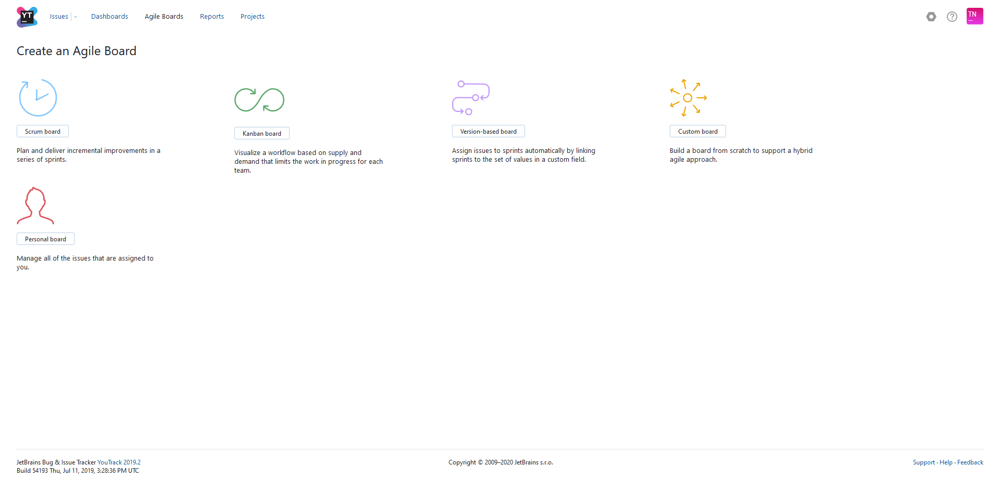

# Youtrack - Nenad Tripi&#x0107;

  

*Important links and documentations are linked in the [presentation](slides-youtrack.html).*
Furthermore you can find a [PDF](slides-youtrack.pdf) Version of it as well.
YouTrack of HTL-Leonding: https://vm81.htl-leonding.ac.at

## What is YouTrack?

  

YouTrack is a project management tool that can be adapted to your processes to help you deliver software. Track tasks and bugs, plan sprints and releases, create workflows, and customize YouTrack for your business processes. Never force your process to fit the limits of a tool. Unlike other issue trackers, YouTrack can be customized to your needs. Which makes it unique to your company eventually.

### Agile boards
The most common agile boards like scrum boards and kanban boards are implementable in YouTrack. Other boards are available as well but are pretty much custom to your needs.

### Difference between scrum and kanban
These bulletpoints cover the most important things about scrum and kanban, however if you like more information about it, I would like to suggest this [link](https://blog.valiantys.com/en/jira-en/jira-agile-scrum-kanban/). There is probably not a perfect solution, you have to decide what fits you the best.
#### Scrum
-   create plan before start of project
-   creating sprints
-   estimate story points
-   backlog
-   plan mode
-   active sprint mode
-   column based
-   more details

#### Kanban  
-   start work without necessarily having a plan
-   without sprints
-   column based
-   deals with all issues rather than portion
-   without user stories time estimates
-   more simple

## YouTrack and GitHub Integration

In this directory you have a pdf which shows you how to add GitHub to your YouTrack. The [presentation](YouTrack-with-GitHub-Integration.pdf) is from **Prof. Stütz** (t.stuetz@htl-leonding.ac.at), all credits go to him.

The presentation is up to date and covers all details.

If you still have problems consider this [website](https://www.jetbrains.com/help/youtrack/standalone/GitHub-Integration.html#) from JetBrains itself.

## Conclusion
YouTrack is a very good tool to monitor and keep track of a project and with the VCS integration even more useful. But imho it is also quite time consuming which means it takes away time which you could use for working on the project itself. Also it is lacking some features which will be in Space, which make this software more valuable than YouTrack.

## Space

  

The next, more advanced tool from JetBrains is Space. It's a whole lot more than YouTrack but is yet to come out as it is early access only at the moment. [JetBrains Space](https://www.jetbrains.com/space/)

